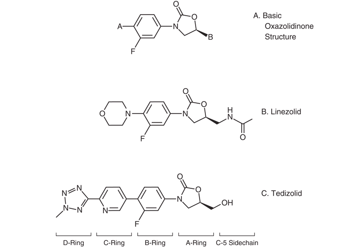

## Oxazolidinones {background-color="#b20e10" background-video="oxazolidinone-images/biofilm.mp4" background-video-loop="true" background-video-muted="true" background-opacity="0.4"}

 

 

 

 

**Russell E. Lewis**   Associate Professor of Infectious Diseases  

   

{fig-align="center" width="350"}

   russelledward.lewis\@unipd.it    [https://github.com/Russlewisbo](https://github.com/Russlewisbo/ESCMID_2022_talk)   Slides and course materials: [www.idpadova.com](https://padovaid.com/)

## Learning objectives

 

- Describe the **chemical features** that distinguish linezolid and tedizolid and the structural basis for activity against *cfr*-carrying strains
- Explain the **mechanism of action** and why oxazolidinones avoid cross-resistance with β-lactams, glycopeptides, daptomycin and quinupristin-dalfopristin
- Recognize the **four major resistance mechanisms** and their clinical implications
- Apply **PK/PD** principles, dosing and TDM thresholds in adults, including special populations
- Choose oxazolidinones appropriately in **MRSA, VRE, MDR-TB, and Nocardia** infections
- Anticipate, monitor for, and manage **hematologic, neurologic, metabolic, and serotonergic toxicities**

# Overview and chemistry {background-color="#b20e10"}

## A fully synthetic antibiotic class

 

- Oxazolidinones are prepared entirely by **organic synthesis** — no fermentation product
- 1978: DuPont patents 5-(halomethyl)-3-aryl-2-oxazolidinones with activity against **plant pathogens**
- Further optimization → first agents with activity against **human pathogens**

::: aside
[@Slee1987]
:::

::: notes
A nice point for trainees: this is one of the few entirely synthetic antibiotic classes — contrast with β-lactams (fungal), aminoglycosides (Streptomyces), glycopeptides (Amycolatopsis). The class arrived with no natural environmental reservoir of resistance — which delayed but did not prevent emergence.
:::

## Two FDA/EMA-approved agents

 

| Drug                      | Trade name | FDA approval |
|---------------------------|------------|--------------|
| **Linezolid**             | Zyvox      | April 2000   |
| **Tedizolid** (phosphate) | Sivextro   | June 2014    |

 

- Investigational agents: **sutezolid, radezolid, delpazolid, contezolid**
- No drug-class cross-resistance with β-lactams, vancomycin, daptomycin, or quinupristin-dalfopristin

::: notes
Note that tedizolid is a prodrug — phosphate ester cleaved by plasma phosphatases. Contezolid (MRX-I) is approved in China for ABSSSI; emphasize that the pipeline is moving on TB indications.
:::

## Basic oxazolidinone scaffold

 

{fig-align="center" width="350"}

- Core five-membered **2-oxazolidinone ring** (the "A-ring")
- **C5 modification** of the A-ring and **N-aryl B-ring** are essential for antibacterial activity
- **Fluorination of the B-ring** further increases potency

::: aside
The C5 side chain is the structural feature that diverges between linezolid and tedizolid — and is the most important thing to remember when explaining why tedizolid keeps activity against cfr-carrying strains.[@Rybak2015]
:::

## Linezolid — structural features

 

- C5 **acetamide** side chain on the A-ring
- N-aryl B-ring with **single fluorine**
- Single morpholine D-substituent
- Sufficient for activity against typical Gram-positive targets

::: aside
[@Rybak2015]
:::

## Tedizolid — engineered for breadth

 

- C5 **hydroxymethyl** group replaces acetamide → preserves activity against ***cfr*****-carrying** strains
- Added **pyridine (C-ring) and tetrazole (D-ring)** moieties → lower MICs
- Administered as the **phosphate prodrug** (Sivextro)

::: aside
[@Rybak2015; @Locke2010]
:::

::: notes
Teach the takeaway: the hydroxymethyl group is the specific modification that defeats Cfr methylation of A2503. The tetrazole/pyridine contribute to overall MIC reduction but are not the cfr-defeating feature.
:::

# Mechanism of action

## Where do oxazolidinones bind?

 

- Bind the **V domain of the 23S rRNA** in the 50S ribosomal subunit
- Engage the **A-site of the peptidyl transferase center (PTC)**
- Block placement of aminoacyl-tRNA → halt **peptide elongation at initiation**

::: aside
[@Colca2003; @Moellering2003]
:::

::: notes
Emphasize that oxazolidinones block one of the earliest steps in protein synthesis. Chloramphenicol and lincomycin bind in overlapping sites — useful for explaining mechanistic competition observed in vitro.
:::

## Bacteriostatic — and why that's fine

 

- Generally **bacteriostatic** against staphylococci and enterococci; modestly bactericidal against streptococci
- "Static vs cidal" distinction is **clinically overrated** — systematic review found no consistent outcome difference
- Don't withhold linezolid in *S. aureus* bacteremia on cidal-vs-static grounds alone

::: aside
[@WaldDickler2018]
:::

::: notes
This is a recurring exam-style question and a recurring stewardship discussion. The Wald-Dickler review is worth assigning as background reading.
:::

# Spectrum of activity

## Aerobic Gram-positive activity (Table 32.1)

 

| Organism               | Linezolid MIC₉₀ (μg/mL) | Tedizolid MIC₉₀ (μg/mL) |
|------------------------|------------------------:|------------------------:|
| MSSA                   |                       2 |                    0.25 |
| MRSA                   |                       2 |                    0.25 |
| *S. agalactiae*        |                       2 |                    0.25 |
| *S. anginosus* gp      |                       1 |                    0.25 |
| *S. pyogenes*          |                       2 |                    0.25 |
| *E. faecalis*          |                       2 |                    0.25 |
| *E. faecalis* (LZD-NS) |                       8 |                       1 |
| *E. faecium*           |                       2 |                     0.5 |

::: aside
[@Carvalhaes2022]
:::

## Tedizolid is more potent in vitro — but…

 

- Tedizolid MICs are **2–8× lower** than linezolid across most Gram-positive species
- **Lower MIC ≠ better clinical outcome** without head-to-head trials
- CLSI: tedizolid susceptibility can be **inferred from linezolid susceptibility** for *S. aureus*, *E. faecalis*, *S. agalactiae*, *S. pyogenes*, *S. anginosus*
- **Linezolid-resistant** strains may still be tedizolid-susceptible

::: aside
[@CLSI2022; @EUCAST2022]
:::

## Mycobacteria

 

- Excellent activity against **MDR- and XDR-***M. tuberculosis*
  - Linezolid MIC range: **0.125–2 μg/mL**
  - Tedizolid MIC range: **0.125–0.5 μg/mL**
- Active against rapid growers (*M. abscessus* spp., *M. massiliense*) and **slow-grower *M. kansasii***
- Higher MICs for *M. avium* / *M. intracellulare*

::: aside
[@Yang2012; @Aono2022]
:::

## Nocardia and other higher-order bacteria

 

- Linezolid: **virtually 100% in vitro susceptibility** across *Nocardia* spp.
  - MIC₉₀ 1–4 μg/mL
- Tedizolid: lower MICs than linezolid for most *Nocardia* spp.
  - Comparable to linezolid for ***N. nova*** **complex** and ***N. brasiliensis***
- Variable activity vs. actinomycetes; *Corynebacterium*, *Listeria*, *Bacillus*, *Erysipelothrix*, *Rhodococcus equi*, *Leuconostoc*, *Pediococcus* — case-by-case

::: aside
[@Larruskain2011; @BrownElliottNoc2017]
:::

## Where oxazolidinones do NOT shine

 

- **Aerobic Gram-negatives:** limited
- Incomplete coverage of respiratory pathogens *H. influenzae* and *Moraxella catarrhalis*
- **Anaerobes:** decent activity against both Gram-positive and Gram-negative anaerobes
  - *Clostridium* spp., *Bacteroides* spp.

::: aside
[@Biedenbach2001; @Goldstein1999]
:::

::: notes
This is why linezolid is not used as empirical monotherapy in nosocomial pneumonia or intra-abdominal infection without a Gram-negative companion.
:::

# Resistance

## The headline numbers

 

- Linezolid resistance **reported pre-marketing** (Compassionate Use Program, VRE)
- \~25 years post-launch, resistance still **\<1%** of clinical isolates
- Tedizolid resistance **rarer** than linezolid resistance over a 5-year surveillance
- **Enterococci \> staphylococci** for resistance frequency

::: aside
[@Birmingham2003; @Mendes2018]
:::

## Risk factors for resistance

 

- **Prior linezolid exposure**
- **Prolonged therapy** (weeks to months)
- Horizontal spread within ICUs and long-term care facilities
- Stewardship implication: limit duration, monitor when prolonged use unavoidable

::: aside
[@Pogue2007; @Bonilla2010]
:::

## Mechanism 1 — 23S rRNA mutations

 

- Chromosomal point mutations in the **V domain of 23S rRNA**
- Most common single mutation: **G2576T** in *E. coli* numbering
- Because bacteria carry **multiple copies** of the gene, multiple mutated copies are needed for clinical resistance
- Most often identified in **enterococci and staphylococci**

::: aside
[@Long2012]
:::

## Mechanism 2 — ribosomal protein mutations

 

- Mutations in genes encoding **L3, L4, and possibly L22** (50S ribosomal proteins)
- Reshape the PTC and reduce drug binding
- Described in **staphylococci, *S. pneumoniae*, and *C. perfringens***

::: aside
[@Holzel2010; @Brenciani2022]
:::

## Mechanism 3 — *cfr* methyltransferase

 

- *cfr* = **chloramphenicol-florfenicol resistance** gene
- Encodes a **23S rRNA methyltransferase** that methylates A2503
- Confers cross-resistance to: **phenicols, lincosamides, oxazolidinones, pleuromutilins, streptogramin A** (PhLOPSₐ phenotype)
- **Plasmid-borne and globally disseminated**

::: aside
[@Diaz2012; @Brenciani2022]
:::

::: notes
PhLOPSₐ is worth committing to memory. Tedizolid's hydroxymethyl side chain is what allows it to retain activity against many cfr-carrying strains — but combined with chromosomal mutations, tedizolid resistance does emerge.
:::

## Mechanism 4 — optrA and poxtA

 

- Plasmid-borne genes encoding **ABC-F ribosomal protection proteins**
- Mediate resistance through **target protection** (not modification)
- ***optrA***: enterococci (esp. animal isolates), staphylococci, streptococci
- ***poxtA***: enterococci primarily
- Additional mechanisms: active efflux, biofilm formation, loss of *rlmN*

::: aside
[@Wang2015; @Bender2018]
:::

## Tedizolid vs. linezolid-resistant strains

 

- Tedizolid retains activity against many ***cfr*****-positive** strains of *S. aureus*, CoNS, and enterococci
- Activity **lost** when *cfr* coexists with chromosomal ribosomal mutations
- **Practical message:** test before assuming susceptibility in known LZD-R isolates

::: aside
[@Locke2010]
:::

# Pharmacology — linezolid

## Linezolid — dosing fundamentals

 

- **Adults / adolescents:** 600 mg PO or IV every 12 hours
- **Uncomplicated SSTI in adults:** 400 mg every 12 hours
- **Pediatric (birth–11 y):** 10 mg/kg every 8 hours (every 12 h for uncomplicated SSTI in children 5–11 y)
- **Bioavailability \~100%** — oral and IV interchangeable

::: aside
[@ZyvoxPI]
:::

## Linezolid — distribution

 

- Plasma protein binding: **31%**
- Excellent penetration into **lung (ELF, alveolar macrophages)** and **skin and soft tissue**
- **CSF**: trough \<0.2–7.0 μg/mL; peaks 3.1–12.5 μg/mL in meningitis; **CSF/plasma ratio 0.77–1.0**
- **Bone and joint penetration variable** — case-by-case

::: aside
[@Villani2002; @Luque2014]
:::

## Linezolid — metabolism and clearance

 

- Metabolized by **oxidation** — minimal CYP450 interaction
- **65% nonrenal** clearance; **30%** excreted unchanged in urine
- Two **inactive carboxylic-acid metabolites** in feces
- **Half-life \~5–7 hours** in adults
- **Hemodialysis removes linezolid** → dose after dialysis
- **CRRT** also removes drug; no routine dose change recommended

::: aside
[@Obach2022]
:::

## Linezolid — PK/PD targets

 

- Driver of efficacy: **fT \> MIC ≈ 85%** and **AUC₀₋₂₄/MIC 80–120**
- High **inter-individual variability** can compromise targets at standard dose
- **At-risk populations:**
  - Overexposure: renal dysfunction, older age, hepatic failure, low body weight
  - Under-exposure: augmented renal clearance, younger age, obesity
  - Both: critical illness

::: aside
[@Roger2018]
:::

## Linezolid — when to consider TDM

 

- Trough **C_min 2–7 mg/L** suggested for Gram-positive infection
- **C_min \<2 mg/L** proposed for *M. tuberculosis* (MICs lower)
- **C_min \>7.5–22.1 mg/L** → hematologic toxicity risk rises
- Strongest case for TDM: critically ill, **prolonged therapy**, renal dysfunction, drug interactions

::: aside
[@Pea2012; @Rao2020]
:::

## Linezolid — drug interactions (PK)

 

- **Rifampin** → ↓ AUC \~32% (P-gp induction?)
- **Levothyroxine** → ↓ linezolid concentrations
- **Clarithromycin** → ↑ linezolid AUC \>3-fold
- **Amlodipine, amiodarone, omeprazole, warfarin** → linezolid overexposure reports
- Linezolid likely a **P-glycoprotein substrate**

::: aside
[@Gandelman2011; @Bolhuis2010]
:::

# Pharmacology — tedizolid

## Tedizolid — the prodrug story

 

- **Tedizolid phosphate** → cleaved by plasma phosphatases → active tedizolid
- **Bioavailability \~91%** — no dose adjustment IV vs. PO
- **200 mg once daily** PO or IV (adults and pediatric ≥ 12 y)
- **Half-life \~12 hours** supports once-daily dosing
- Oral product taken **without regard to meals**

::: aside
[@SivextroPI]
:::

## Tedizolid — distribution and metabolism

 

- Plasma protein binding **70–90%** (free fraction ≈ linezolid)
- **ELF AUC : plasma AUC = 40** and **AM : plasma = 20** → high lung penetration
- **Hepatic** metabolism → **sulfate conjugate** in feces; \<3% unchanged in urine
- **No dose adjustment** for hepatic, renal, dialysis, or obesity (BMI \>30)

::: aside
[@Iqbal2022a]
:::

## Tedizolid — special PK/PD caveats

 

- Free **AUC/MIC ratio** best predicts efficacy in murine models
- **Markedly reduced antistaphylococcal activity in granulocytopenic mice** — concerning signal
- Less pronounced effect in *S. pneumoniae* lung models
- **Product label cautions against use in neutropenic patients** — sparse human data

::: aside
[@Drusano2011; @Xiao2019]
:::

::: notes
This neutropenia signal is the single most important PK/PD difference to remember between the two drugs — it is the main reason tedizolid is not yet a routine substitute for linezolid in bone-marrow transplant or chemotherapy patients.
:::

## Tedizolid — drug interactions

 

- Negligible CYP450 interaction
- **Inhibits intestinal BCRP** → ↑ serum levels of rosuvastatin, methotrexate
- **Weak, reversible MAOI** activity in vitro — less risk than linezolid but not zero
- Four post-marketing serotonin syndrome reports to FAERS

::: aside
[@SivextroPI; @Flanagan2015]
:::

# Clinical use

## FDA-approved indications — linezolid

 

- **Nosocomial pneumonia** (MRSA/MSSA, *S. pneumoniae*)
- **Community-acquired pneumonia** (*S. pneumoniae* including bacteremic; MSSA)
- **Complicated SSTI** (including diabetic foot, *without* osteomyelitis)
- **Uncomplicated SSTI** (MSSA, *S. pyogenes*)
- **VRE *E. faecium*** infections (including bacteremia)

::: aside
[@ZyvoxPI]
:::

## FDA-approved indications — tedizolid

 

- **Acute bacterial skin and skin-structure infection (ABSSSI)** in adults and **pediatric patients ≥ 12 years**
- Susceptible Gram-positive pathogens:
  - *S. aureus* (MRSA/MSSA), *S. pyogenes*, *S. agalactiae*, *S. anginosus* group, *E. faecalis*

::: aside
[@SivextroPI]
:::

## MRSA SSTI — linezolid vs vancomycin

 

- **Cochrane review** (9 RCTs): linezolid superior to vancomycin for clinical and microbiologic cure; shorter LOS, lower cost
- Superiority observed in **adults** but not in \<18 y
- Recent **network meta-analysis**: linezolid superior to vancomycin; comparable to dapto, ceftaroline, telavancin, tigecycline, tedizolid

::: aside
[@Yue2016; @Feng2021]
:::

## MRSA nosocomial pneumonia — the Wunderink saga

 

- Pooled analysis of 2 RCTs (Wunderink 2003): linezolid + aztreonam ≈ vanc + aztreonam **overall**; subgroup analysis suggested superior survival in MRSA
- **Subgroup analysis criticized by FDA** (Powers, 2004)
- Subsequent **ZEPHyR trial** (Wunderink 2012): higher clinical success with linezolid, **no 60-day mortality difference**; questioned by under-dosed vancomycin arm

::: aside
[@Wunderink2003; @Wunderink2012]
:::

## MRSA pneumonia — meta-analytic verdict

 

- Pooled RCT data: **no difference** in clinical or microbiologic efficacy or all-cause mortality
- **Nephrotoxicity higher** with vancomycin — robust signal
- Practical message: **either is acceptable**; choose by toxicity profile, route, and TDM feasibility

::: aside
[@Kalil2013]
:::

## *S. aureus* bacteremia — linezolid's evolving role

 

- Effective for **MSSA and MRSA bacteremia** in selected patients
  - Persistent bacteremia, vancomycin failure, salvage scenarios
- **Static vs. cidal** concerns no longer hold up
- **Oral step-down** to linezolid as effective as exclusive parenteral therapy in propensity-matched cohorts (mostly uncomplicated bacteremia)

::: aside
[@Jang2009; @Willekens2019; @Yeager2021]
:::

## POET — oral step-down for left-sided IE

 

- **400 adults** with stable left-sided IE (Strep, *E. faecalis*, *S. aureus*, CoNS)
- ≥ 10 days IV therapy → randomized to **continued IV vs. oral switch**
- 6-month composite (death, surgery, embolism, relapse): **9.0% PO vs. 12.1% IV** — **noninferior**
- **MRSA IE not evaluated** — do not extrapolate
- Guidelines still do **not** list linezolid for MRSA endocarditis

::: aside
[@Iversen2019; @Baddour2015]
:::

## Coagulase-negative staphylococci

 

- Case series support linezolid for **bone/joint, meningitis, VP-shunt, and endocarditis** with prosthetic material
- **Insufficient data** to recommend linezolid as routine first-line
- CoNS endocarditis: small subset in POET treated successfully with oral step-down

## Vancomycin-resistant enterococci

 

- Multiple meta-analyses comparing linezolid vs. **daptomycin** for VRE bacteremia
  - Early data favored linezolid (low daptomycin doses limited interpretation)
  - More recent 22-study meta-analysis: **nonsignificant ↑ mortality with daptomycin**; no difference in microbiologic cure or recurrence
- **VA cohort** (Britt 2015): daptomycin **better** clinical success and 30-day mortality even at relatively low doses
- **Choice should be individualized** — susceptibility, exposure history, source, comorbidities

::: aside
[@Britt2015; @Chuang2014]
:::

## VRE endocarditis

 

- Both **linezolid and daptomycin** are recommended for enterococcal IE resistant to penicillin, aminoglycosides, vancomycin
- Evidence base limited — small numbers, treatment success **and** failure described
- Animal data suggest possible **synergy with gentamicin, doxycycline, ceftriaxone, daptomycin**; clinical use of combinations **unproven**

::: aside
[@Baddour2015]
:::

## Streptococci including *S. pneumoniae*

 

- Effective for **CAP caused by *S. pneumoniae*** in open-label RCTs
- **Not** first-line empirical CAP — poor *H. influenzae* and atypical coverage
- Case reports support pneumococcal CNS infection use, usually with ceftriaxone
- **Group A streptococcal necrotizing soft-tissue infection / toxic shock:** considered as a **clindamycin substitute** (also inhibits exotoxin production)
- 2023 focused debate: linezolid is a **reasonable alternative** when clindamycin is contraindicated, resistant, or in short supply

::: aside
[@Stevens2014; @CortesPenfield2023]
:::

## Tedizolid — ESTABLISH-1 and -2

 

- Two **non-inferiority Phase III** trials in ABSSSI
- **Tedizolid 200 mg × 6 days** vs **linezolid 600 mg BID × 10 days**
- *S. aureus* most common pathogen; **MRSA in 27–42%**
- Both trials: **non-inferior** at 48–72 h and end of therapy
- **Less GI toxicity** and **less thrombocytopenia** with tedizolid

::: aside
[@Prokocimer2013; @Moran2014]
:::

## Tedizolid — beyond skin

 

- Phase III RCT (pediatric ≥ 12 y) for ABSSSI: comparable efficacy and safety
- **Phase III HAP/VAP trial** (Wunderink 2021): non-inferior **day-28 mortality** vs linezolid; failed non-inferiority for **investigator-assessed clinical response** — reason unclear
- Network meta-analysis: tedizolid clinical response **superior to vancomycin**, comparable to linezolid, dapto, ceftaroline, telavancin, teicoplanin, tigecycline

::: aside
[@Wunderink2021; @Feng2021]
:::

## Linezolid in MDR/XDR-TB — the modern role

 

- Linezolid is now **central** to drug-resistant TB regimens
- **BPaL regimen** (bedaquiline + pretomanid + linezolid 1200 mg/day, 6 mo): \~**90% favorable outcomes** in highly drug-resistant TB
- **WHO 2022:** BPaL endorsed for 6–9 months in MDR/RR-TB
- BUT: **\>80% experienced toxicity** at 1200 mg/day (neuropathy, myelosuppression)

::: aside
[@Conradie2020; @Mirzayev2021]
:::

## ZeNix — getting the dose right

 

- 2×2 factorial: linezolid **1200 vs 600 mg/day** and **26 vs 9 weeks** within BPaL
- **600 mg/day × 26 weeks**: favorable outcome **91%** (vs 94% with 1200 mg)
- **Substantially less neuropathy and myelosuppression** at the lower dose
- Modeling: 600 mg/day balances efficacy and AE risk
- **Bottom line:** 600 mg/day × 26 weeks is the preferred dose

::: aside
[@Conradie2022; @Imperial2022]
:::

## Nocardia — linezolid's place

 

- **Near-universal** susceptibility, oral bioavailability, CNS penetration → attractive option
- **Combination induction therapy** for disseminated, cutaneous, or moderate-severe pulmonary disease
- Often with **TMP-SMX + ceftriaxone**; alternative when amikacin or TMP-SMX toxicity limits use
- 1-year survival \~85% — comparable to other regimens
- Main toxicity = **thrombocytopenia**

::: aside
[@Larruskain2011]
:::

## Oral vs. intravenous

 

- **Bioavailability ≈ 100%** (linezolid) and **\~91%** (tedizolid) → oral substitutes for IV when clinically appropriate
- Use oral when:
  - Patient **clinically stable and reliable**
  - **GI absorption intact**
  - Indication has supporting peer-reviewed evidence
- Strong stewardship argument — earlier discharge, lower cost

# Adverse effects

## Overall tolerability

 

- Both agents **generally well tolerated**
- Common AEs (more frequent with linezolid):
  - **Headache, nausea, vomiting, diarrhea**
- Serious AEs are uncommon but **dose- and duration-dependent**

::: aside
[@ZyvoxPI; @SivextroPI]
:::

## Hematologic toxicity — the headline AE

 

- **Reversible myelosuppression**: thrombocytopenia \>\> anemia, pancytopenia, pure red cell aplasia
- Phase III data: thrombocytopenia in **2.4%** of adults (range 0.3–10%)
- **Risk factors:** prolonged duration, renal insufficiency, hepatic impairment, baseline marrow suppression
- Mechanism: drug-induced immune-mediated **and** progenitor suppression

::: aside
[@Gerson2002; @Bernstein2003]
:::

## Hematologic toxicity — monitoring

 

- **Weekly CBC** if therapy ≥ 2 weeks (per label)
- **TDM useful**: trough **\>7.5–22.1 mg/L** associated with hematologic toxicity
- **Tedizolid**: thrombocytopenia 2.1% (6 d) vs 3.8% linezolid (10 d) in pooled ABSSSI data
- Long-term tedizolid (median 28 d): 6/81 thrombocytopenia — uncommon, often clinically tolerable

::: aside
[@Pea2012]
:::

## Monoamine oxidase inhibition

 

- Linezolid: **reversible, nonselective MAO inhibitor**
- **Serotonin syndrome** with concurrent serotonergic agents
  - Highest-risk co-medications in FAERS: **citalopram, escitalopram, methadone**
- Overall a **rare event** — risk/benefit reasonable in many patients
- Tedizolid: weak in vitro MAOI; only 4 FAERS reports — risk **likely lower** but not zero

::: aside
[@Gatti2021a; @Traver2022]
:::

## Tyramine and adrenergic interactions

 

- Modest **↑ systolic BP** with concurrent tyramine → label dietary cautions
- Blood pressure monitoring recommended with concurrent **adrenergic agents** or hypertension
- Practical: review SSRI/SNRI/MAOI co-medications **before** starting linezolid

::: aside
[@ZyvoxPI]
:::

## Mitochondrial toxicity — unifying concept

 

- Disruption of **mitochondrial protein synthesis** explains:
  - **Peripheral and optic neuropathy**
  - **Lactic acidosis**
  - Possibly **rhabdomyolysis** and drug-induced liver injury
- Tedizolid is theoretically a **more potent** mitochondrial inhibitor — but lower free exposure and a recovery window each dosing interval may **reduce in vivo risk**

::: aside
[@DeVriese2006; @Flanagan2015]
:::

## Neuropathy

 

- **Peripheral neuropathy**: distal dysesthesias, often poorly reversible — prolonged therapy
- **Optic neuropathy**: gradual visual blurring; visual loss can be permanent if drug not stopped — **reversible if caught early**
- Phase III data: peripheral/optic neuropathy similar between tedizolid (6 d) and linezolid (10 d) — short courses
- **Watch for it** in prolonged TB or osteomyelitis courses — French MDR-TB cohort: high neurologic AE burden

::: aside
[@Jaspard2020; @Imperial2022]
:::

## Lactic acidosis

 

- Rare but **including fatal cases**
- Most often during **prolonged** therapy — but can develop within the **first week**
- **Prompt recognition and drug discontinuation** are critical
- Risk increased: age, renal insufficiency, drug interactions causing overexposure
- Possible genetic predisposition (mitochondrial ribosome polymorphisms)
- Tedizolid lactic acidosis reported to FAERS — causality less clear

::: aside
[@Narita2007; @Santini2017]
:::

## Miscellaneous and rare AEs

 

- **Increased mortality** when used as monotherapy for catheter-related infections with Gram-negative or mixed flora
- Hyponatremia / SIADH, **PRES**, seizures
- Tooth and tongue discoloration, **black hairy tongue**
- **Hypoglycemia** in diabetic patients on insulin or oral hypoglycemics
- Oral suspension contains **phenylalanine** — caution in PKU

::: aside
[@Wilcox2009; @Viswanathan2014]
:::

# Pipeline

## Investigational oxazolidinones

 

- **Radezolid** — broader Gram-positive activity, including LZD-R strains
- **Sutezolid** — structurally similar to linezolid; potent **anti-mycobacterial** activity
- **Delpazolid** — Gram-positive activity similar to linezolid; **superior in vitro vs mycobacteria**
- **Contezolid (MRX-I)** — activity vs MRSA, VRE, mycobacteria; approved in China for ABSSSI

::: aside
[@Foti2021; @Wang2021; @Shoen2018]
:::

::: notes
The whole pipeline is essentially pushing on two axes: (1) defeating cfr-mediated resistance, and (2) improving the TB therapeutic index. Contezolid is the most likely near-term Western approval candidate based on safety data.
:::

# Take-home points

## Five things to remember

 

1.  **Two FDA agents** — linezolid (BID, 100% bioavail), tedizolid (QD prodrug, retains activity vs many *cfr* strains)
2.  Bind **23S rRNA / PTC** — no cross-resistance with β-lactams, glyco, dapto, Q-D
3.  Resistance is rare but rising — **23S mutations, L3/L4, *cfr*, optrA/poxtA**
4.  **TDM** when prolonged, renal failure, or critically ill — trough **2–7 mg/L** for Gram-positive infection
5.  **Toxicity profile** drives long-term decisions — myelosuppression, neuropathy, lactic acidosis, serotonin syndrome

## Questions?

 

<!-- IMAGE NEEDED: optional closing image — UniPD seal or DM logo -->

::: notes
Open the floor. Likely Q&A topics for ID trainees: - Concrete TDM example with calculations - Choosing linezolid vs daptomycin for VRE bacteremia - Which TB patients should still get 1200 mg/day - Managing the SSRI-on-linezolid clinical scenario
:::
