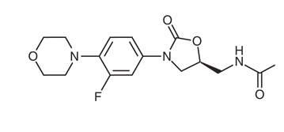
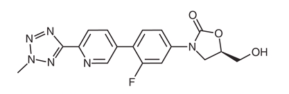
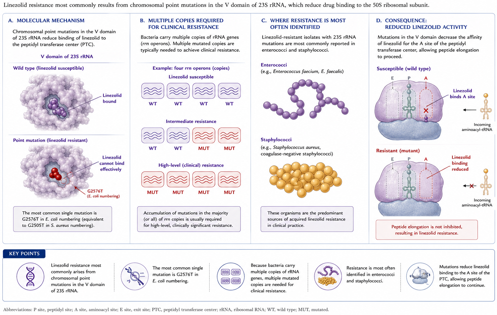
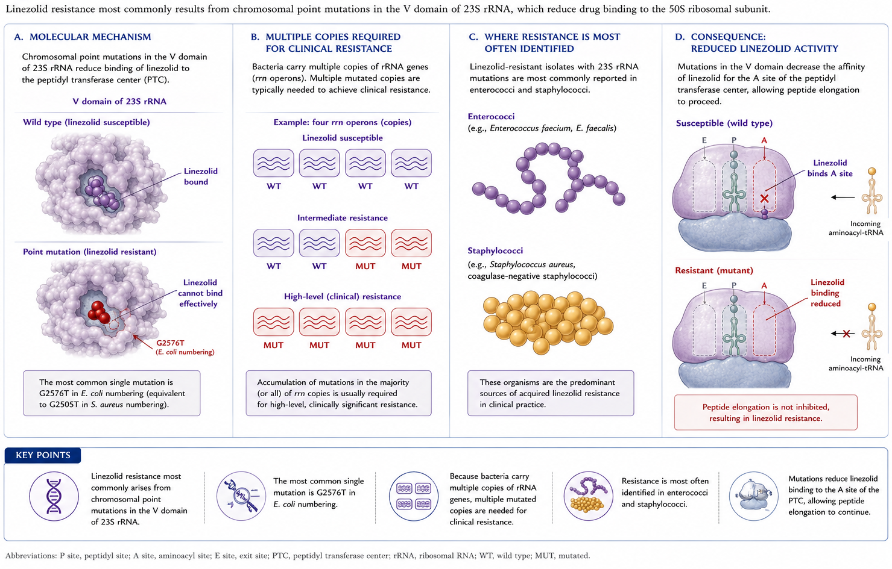
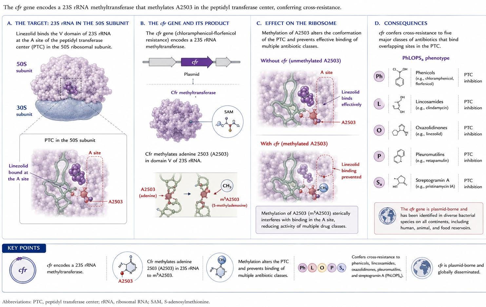
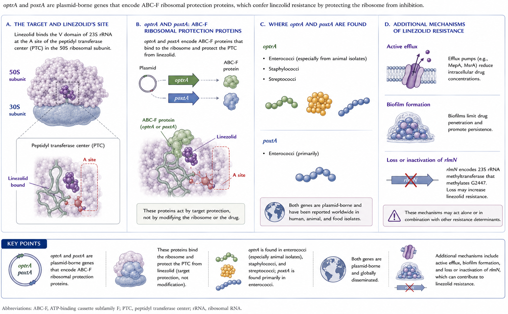

# Short View Summary

Linezolid and tedizolid are the first two oxazolidinones approved for clinical use by the US Food and Drug Administration (FDA).

## Linezolid

::: {.callout-note}
## FDA-approved indications (adults and children)

- Infection with vancomycin-resistant *Enterococcus faecium*
- Community-acquired and nosocomial pneumonia
- Uncomplicated skin and skin structure infections
- Complicated skin and skin structure infections, including diabetic foot infections (without osteomyelitis)
- **Unlabeled use:** alternative or adjunctive therapy of mycobacterial and *Nocardia* infections
:::

- **Usual adult dose:** 600 mg orally or intravenously every 12 hours, with no dosage adjustment for renal or hepatic dysfunction
- **Drug interactions:** serotonergic and adrenergic agents due to monoamine oxidase inhibition
- **Serious adverse effects:** hematologic toxicity (most commonly thrombocytopenia), lactic acidosis, peripheral and optic neuropathy
- **Resistance:** uncommon, most often associated with 23S rRNA G2576T point mutation or acquisition of the *cfr* ribosomal RNA methyltransferase in staphylococci; clinically related to previous or prolonged drug exposure or horizontal spread

## Tedizolid

::: {.callout-note}
## FDA-approved indications

Acute bacterial skin and skin structure infections in adults and pediatric patients ≥ 12 years of age caused by susceptible Gram-positive isolates: *Staphylococcus aureus* (MSSA and MRSA), *Streptococcus pyogenes*, *Streptococcus agalactiae*, *Streptococcus anginosus* group, and *Enterococcus faecalis*.
:::

- **Usual dose:** 200 mg orally or intravenously once daily
- **Drug interactions:** serotonergic and adrenergic interactions possible, but less likely than with linezolid
- **Serious adverse effects:** similar to linezolid but less likely
- **Resistance:** mechanisms similar to linezolid but less common; tedizolid may demonstrate activity against some linezolid-resistant organisms

# Introduction

The oxazolidinones are a class of antimicrobial agents prepared completely by organic synthesis. In 1978, a patent was issued to E. I. du Pont de Nemours and Company for a series of 5-(halomethyl)-3-aryl-2-oxazolidinones with antimicrobial activity against plant pathogens. Further manipulation of the molecule led to the development of linezolid, which displayed activity against human pathogens [@Slee1987]. A number of oxazolidinones remain investigational; only linezolid (Zyvox) and tedizolid (Sivextro) are currently FDA-approved for clinical use.

# Chemical Structure

The basic molecular structure of the oxazolidinones is shown in @fig-structure A [@Rybak2015]. The structure–function relationships of these compounds have been reviewed [@Zhanel2015; @Foti2021; @Burdette2015; @Locke2010]. Manipulation of the A-ring at the C5 position and manipulation of the N-aryl B-ring are necessary elements of oxazolidinone antibacterial activity. Fluorination of the B-ring further increases activity.

In **linezolid** (@fig-structure B), the acetamide moiety at the C5 position of the A-ring contributes to overall activity. **Tedizolid** (@fig-structure C) instead contains a hydroxymethyl group at the same position, which **preserves activity against linezolid-resistant organisms carrying the *cfr* gene**. The favorable MIC profile of tedizolid is associated with the pyridine (C-ring) and tetrazole (D-ring) moieties.

Further biochemical manipulations have created new oxazolidinones with potential clinical utility — **sutezolid, radezolid, delpazolid, and contezolid** — that are presently being evaluated [@Foti2021].

::: {.callout-tip}
## Clinical pearl — no cross-resistance

The unique chemical structure of the oxazolidinones makes cross-resistance with β-lactams, vancomycin, quinupristin–dalfopristin, and daptomycin **unlikely**.
:::

::: {#fig-structure layout-ncol=3}
{#fig-structure-a}

{#fig-structure-b}

{#fig-structure-c}

**(A)** Basic molecular structure of oxazolidinone antibiotics. **(B)** Structure of linezolid. **(C)** Structure of tedizolid. Modified from [@Rybak2015].
:::

# Mechanism of Action

The oxazolidinones are inhibitors of protein synthesis and are usually bacteriostatic, although in some models bactericidal activity against select organisms has been observed. The mechanism is unique: oxazolidinones inhibit the earliest steps of bacterial protein synthesis [@Moellering2003]. They bind the V domain of the 23S rRNA component of the 50S ribosomal subunit, and interaction with the A-site of the peptidyl transferase center blocks peptide elongation (@fig-moa) [@Rybak2015; @Colca2003]. Binding is competitively inhibited by chloramphenicol and lincomycin owing to proximity of the respective binding sites [@Moellering2003].

![Mechanism of action of oxazolidinones. Oxazolidinones bind the V domain of the 23S rRNA of the 50S ribosomal subunit, blocking peptide elongation at the peptidyl transferase center (PTC). Modified from [@Colca2003].](oxazolidinone-images/linezolid_MOA.png){#fig-moa fig-align="center"}

# Antimicrobial Activity

## General considerations

In vitro studies have established MICs of linezolid and tedizolid against a wide variety of organisms. In general, comparisons show **tedizolid to be two- to eight-fold more potent** [@Rybak2015; @Zhanel2015; @Burdette2015; @Locke2010; @Diekema2001]. Lower MICs may not translate into superior clinical activity, however; only direct clinical comparisons can establish that.

## Activity against Gram-positive organisms

Both linezolid and tedizolid demonstrate consistent activity against most clinically important Gram-positive organisms: *S. aureus* (MSSA, MRSA, vancomycin-intermediate, vancomycin-resistant); coagulase-negative staphylococci; *E. faecalis* and *E. faecium* (vancomycin-susceptible and vancomycin-resistant); and streptococci including penicillin-resistant *S. pneumoniae* (@tbl-mics) [@Rybak2015; @Foti2021; @Colca2003; @Diekema2001; @Locke2014; @Carvalhaes2022; @CLSI2022; @Carvalhaes2020]. Tedizolid consistently has lower MICs across these organisms.

CLSI has established breakpoints for select Gram-positive cocci, noting that tedizolid susceptibility can be inferred for *S. aureus*, *E. faecalis*, *S. agalactiae*, *S. pyogenes*, and *S. anginosus* isolates that test susceptible to linezolid. Linezolid-resistant strains may still be tedizolid-susceptible [@CLSI2022]. EUCAST offers similar guidance for staphylococci and β-hemolytic streptococci [@EUCAST2022].

A variety of other Gram-positive organisms may be susceptible to linezolid or tedizolid, though fewer isolates have been evaluated: *Corynebacterium* spp., *Listeria monocytogenes*, *Bacillus* spp., *Micrococcus* spp., *Erysipelothrix rhusiopathiae*, *Leuconostoc* spp., *Rhodococcus equi*, and *Pediococcus* spp. [@Diekema2001; @Ager2012].

| Organism | Linezolid MIC₉₀ (μg/mL) | Linezolid % susceptible | Tedizolid MIC₉₀ (μg/mL) | Tedizolid % susceptible |
|----------|-----------------------:|:----------------------:|------------------------:|:----------------------:|
| *S. aureus* — oxacillin-susceptible | 2 | 100 | 0.25 | 100 |
| *S. aureus* — oxacillin-resistant   | 2 | >99.9 | 0.25 | >99.9 |
| *S. agalactiae*                     | 2 | 100 | 0.25 | 100 |
| *S. anginosus* group                | 1 | 100 | 0.25 | 100 |
| *S. pyogenes*                       | 2 | 100 | 0.25 | 100 |
| *E. faecalis*                       | 2 | 99.5 | 0.25 | 99.9 |
| *E. faecalis* — linezolid-nonsusceptible | 8 | 0 | 1 | 73.1 |
| *E. faecium*                        | 2 | 99.1 | 0.5 | — |

: In vitro susceptibility of common aerobic Gram-positive organisms to linezolid and tedizolid. Compiled from [@Carvalhaes2022; @CLSI2022; @Carvalhaes2020]. CLSI susceptibility breakpoints: staphylococci ≤4 μg/mL (linezolid), ≤0.5 μg/mL (tedizolid, *S. aureus* only); β-hemolytic streptococci ≤2 μg/mL (linezolid), ≤0.5 μg/mL (tedizolid, *S. pyogenes* and *S. agalactiae* only); viridans streptococci ≤2 μg/mL (linezolid), ≤0.25 μg/mL (tedizolid); enterococci ≤2 μg/mL (linezolid), ≤0.5 μg/mL (tedizolid, *E. faecalis* only). Dashes indicate no determined breakpoint. {#tbl-mics}

## Activity against higher-order bacteria

Linezolid has in vitro activity against a wide range of *Nocardia* spp., with MIC₉₀ values of 1–4 μg/mL [@Larruskain2011]. Virtually all strains tested are susceptible [@Hamdi2020; @Yeoh2022]. Tedizolid demonstrates MIC₉₀ values several-fold lower than linezolid for many species, with the exception of *Nocardia nova* complex and *Nocardia brasiliensis*, where values are comparable [@BrownElliottNoc2017]. Limited data suggest that some actinomycetes may also be susceptible [@BrownElliottNoc2017].

## Activity against *Mycobacterium* spp.

Oxazolidinones have demonstrated activity against *M. tuberculosis*, including multidrug-resistant (MDR) and extensively drug-resistant (XDR) strains. Linezolid MIC range is approximately 0.125–2 μg/mL, even for MDR and XDR isolates [@Moellering2003; @Ashtekar1991; @Yang2012; @Aono2022]. Tedizolid MICs typically range from 0.125–0.5 μg/mL [@Aono2022; @Ruiz2019]. Resistance to linezolid in MDR-TB has been reported but appears uncommon [@Tornheim2020].

Both agents also have in vitro activity against nontuberculous mycobacteria. MICs for rapid growers such as *M. abscessus* subsp. *abscessus* and *M. abscessus* subsp. *massiliense* and for the slow grower *M. kansasii* are lower than for *M. avium* and *M. intracellulare* [@Moellering2003; @Ashtekar1991; @Wallace2001; @BrownElliott2003; @BrownElliottNTM2017; @Kim2021]. Tedizolid appears more potent for the strains tested, but the clinical significance is unclear [@BrownElliottNTM2017].

## Activity against other organisms

The oxazolidinones have **limited activity against aerobic Gram-negatives**. Assessment of respiratory pathogens shows that both agents provide incomplete coverage for *Haemophilus influenzae* and *Moraxella catarrhalis* [@Zhanel2015; @Moellering2003; @Biedenbach2001]. Both oxazolidinones possess activity against Gram-positive and Gram-negative anaerobes, including *Clostridium* spp. and *Bacteroides* spp. [@Diekema2001; @Carvalhaes2022; @Goldstein1999].

::: {.callout-warning}
## Practical implication

Because oxazolidinones lack reliable Gram-negative activity, **do not use linezolid or tedizolid as monotherapy for empirical nosocomial pneumonia or intra-abdominal infection** — pair with an agent that covers Gram-negatives.
:::

# Resistance

Resistance to linezolid was reported even before the drug was released in the United States, among patients treated for vancomycin-resistant enterococci (VRE) under the Linezolid Compassionate Use Program [@Birmingham2003]. Despite use in the United States since 2000, resistance remains **<1%** of clinical isolates [@Mendes2018]. **Enterococci and, to a lesser extent, staphylococci** are the organisms most often associated with resistance; **prior drug exposure** and **prolonged therapy** are the most common predisposing factors [@Meka2004; @Garcia2010; @Bai2019]. Although unusual, outbreaks due to linezolid-resistant bacteria are well described [@Pogue2007; @Bonilla2010; @Ntokou2012; @Scheetz2008; @Cox2012].

Similar susceptibility to tedizolid has been observed over a 5-year surveillance period, with activity against some linezolid-resistant strains. Tedizolid resistance is less frequent than linezolid resistance [@Carvalhaes2022; @Carvalhaes2020].

## Mechanism 1 — 23S rRNA mutations

A frequent mechanism involves chromosomal mutations of the oxazolidinone binding site on the **V region of 23S rRNA** (@fig-res1). Because bacteria carry numerous copies of the gene, **multiple mutations are needed for clinical resistance**. This is most often identified in enterococci and staphylococci [@Long2012].

{#fig-res1 fig-align="center"}

## Mechanism 2 — ribosomal protein mutations

Additional binding-site modifications come from mutations in genes encoding the 50S ribosomal proteins **L3, L4, and possibly L22** (@fig-res2). These have been implicated in resistance in staphylococci, *S. pneumoniae*, and *Clostridium perfringens*, among others [@Long2012; @Holzel2010; @Brenciani2022].

{#fig-res2 fig-align="center"}

## Mechanism 3 — *cfr* methyltransferase

Acquisition of mobile genetic elements is another important mechanism. The ***cfr*** (chloramphenicol-florfenicol resistance) gene encodes a ribosomal RNA methyltransferase that confers resistance to **phenicols, lincosamides, oxazolidinones, pleuromutilins, and streptogramin A** antibacterial agents (the PhLOPSₐ phenotype; @fig-res3) [@Diaz2012]. It has been identified in a large number of Gram-positive organisms (enterococci, staphylococci, *Bacillus* spp.) and some Gram-negatives; *cfr*-like genes confer the same phenotype [@Brenciani2022].

{#fig-res3 fig-align="center"}

::: {.callout-important}
## Why tedizolid's structure matters here

Tedizolid's hydroxymethyl C5 side chain allows it to **retain activity against many *cfr*-positive isolates** of *S. aureus*, coagulase-negative staphylococci, and enterococci. However, tedizolid resistance may emerge when *cfr* is combined with chromosomal ribosomal mutations [@Burdette2015].
:::

## Mechanism 4 — *optrA* and *poxtA*

Other plasmid-borne resistance genes include ***optrA*** and ***poxtA***, which encode an ABC-F protein that mediates resistance through **target protection** (@fig-res4) [@Brenciani2022; @Bender2018]. *optrA* has been identified most commonly in enterococci (including a widespread presence among isolates of animal origin), streptococci, and staphylococci, whereas *poxtA* has been found primarily in enterococci [@Brenciani2022; @Bender2018; @Wang2015].

{#fig-res4 fig-align="center"}

## Other resistance mechanisms

Other mechanisms include **active efflux, biofilm production**, and loss of activity of the *rlmN* gene, which encodes an RNA methyltransferase [@Brenciani2022].

# Pharmacology

## Linezolid

The approved adult/adolescent dose of linezolid is **600 mg intravenously or orally every 12 hours** for serious infections, with **400 mg every 12 hours** for adults with uncomplicated SSTI. Pediatric dosing is generally **10 mg/kg every 8 hours** in patients from birth to 11 years owing to increased weight-based clearance; the frequency is reduced to every 12 hours in children 5–11 years for uncomplicated SSTI.

**Absorption** after ingestion is rapid, with peak serum levels at 1–2 hours and bioavailability approaching **100%**. The standard 600 mg twice-daily regimen yields peak serum concentrations of 15.1 μg/mL (oral) and 21.2 μg/mL (IV) — well above the MIC₉₀ for usual targets [@ZyvoxPI].

**Distribution.** Linezolid is **31% bound** to plasma proteins. It distributes readily into well-perfused tissues, achieving adequate concentrations in **pulmonary epithelial lining fluid, alveolar macrophages, and skin and soft tissue** [@ZyvoxPI; @Roger2018]. Trough CSF concentrations in post-neurosurgical patients and in one patient with meningitis ranged from <0.2 to 7.0 μg/mL with **CSF/plasma ratios of 0.77–1.0** [@Villani2002; @Zeana2001; @Luque2014]. Peak CSF concentrations of 3.12–12.5 μg/mL have been documented in meningitis [@Zeana2001; @Shaikh2001]. **Bone and joint** tissue penetration is variable [@Roger2018; @Koch2022].

**Metabolism and clearance.** Linezolid is metabolized by oxidation and interacts minimally with the common drug-metabolizing CYP450 enzymes [@Obach2022]. Approximately **65% of total clearance is nonrenal**; 30% is excreted unchanged in urine, and fecal excretion of two inactive carboxylic acid metabolites accounts for most of the remainder [@ZyvoxPI; @Roger2018]. Elimination half-life in adults is **5–7 hours** [@Roger2018]. No dose adjustment is suggested in product labeling for renal or mild-to-moderate hepatic impairment, but because linezolid and its metabolites are removed by dialysis, **administration after hemodialysis** is suggested [@ZyvoxPI]. Continuous renal replacement therapy also removes drug; no routine dose change is definitively recommended [@Bandin2022; @DiPaolo2010].

Limited case-report data have not signaled adverse outcomes in pregnancy; however, given fetal harm in animals, linezolid in pregnancy should be used **only when the potential benefit outweighs the potential fetal risk** [@ZyvoxPI].

::: {.callout-tip}
## PK/PD targets

The parameters most predictive of efficacy are the **time above MIC (T > MIC ≥ 85%)** and the **AUC/MIC ratio (target 80–120)** [@Roger2018]. Large interindividual variability with standard dosing may threaten target attainment [@Cattaneo2016a].
:::

Pharmacokinetic changes in special populations may predispose to:

- **Overexposure / toxicity**: renal dysfunction, older age, hepatic failure, low body weight
- **Underexposure / therapeutic failure**: augmented renal clearance, younger age, obesity
- **Both**: critical illness [@Bandin2022; @Rao2020]

Recommendations for therapeutic drug monitoring (TDM) have therefore gained momentum [@AbdulAziz2020]. A target steady-state trough concentration (C~min~) of **2–7 mg/L** has been proposed for Gram-positive infection, whereas a C~min~ **<2 μg/mL** has been proposed for TB infection (where MICs are typically lower) [@Bandin2022]. Further study is needed to standardize TDM targets and dose-adjustment algorithms.

**Drug interactions.** Although mostly free of CYP interactions, linezolid does interact with several agents:

- **Rifampin** → 32% decrease in linezolid AUC in healthy volunteers [@Gandelman2011]
- **Levothyroxine** → reduced linezolid concentrations [@Cattaneo2016b]
- **Clarithromycin** → >3-fold increase in linezolid AUC in a patient receiving treatment for XDR-TB [@Bolhuis2010]
- **Amlodipine, amiodarone, omeprazole, warfarin** → linezolid overexposure reports [@Douros2015; @Sakai2015]

These effects may reflect linezolid acting as a **P-glycoprotein substrate** [@Bolhuis2010; @Pea2012]. Interactions with serotonergic and adrenergic agents are discussed under **Untoward Reactions**.

## Tedizolid

Tedizolid phosphate is a **prodrug** converted in vivo by plasma phosphatases to active tedizolid after oral or IV administration. The phosphate group enhances aqueous solubility, and an absolute **bioavailability of 91%** permits no dosage adjustment between formulations. The approved dose for adults and pediatric patients ≥ 12 years is **200 mg orally or intravenously once daily**. Peak serum concentrations following 200 mg oral and IV doses are 1.8–2.4 μg/mL and 2.6–3.5 μg/mL, respectively. The **half-life of ~12 hours** supports once-daily dosing, and the oral product can be taken without regard to meals.

**Distribution.** Plasma protein binding is **70–90%**, whereas adipose and skeletal muscle penetration yields exposures similar to free plasma drug. Relative pulmonary distribution in healthy volunteers is high, with AUC ratios of epithelial lining fluid and alveolar macrophage to plasma of **40 and 20**, respectively.

**Metabolism and excretion.** Tedizolid is primarily hepatically metabolized and eliminated in feces as an inactive sulfate conjugate; <3% is excreted unchanged in urine. Pharmacokinetic parameters are similar for patients with **hepatic impairment, renal insufficiency (including hemodialysis), and obesity (BMI ≥ 30 kg/m²)** [@Zhanel2015; @SivextroPI; @Iqbal2022a]. **No dose adjustment is required** in these special populations. Pregnant patients should be advised of potential risk given that fetal harm was identified in animal studies [@SivextroPI].

::: {.callout-warning}
## Tedizolid and neutropenia

Free AUC/MIC ratio most closely predicts tedizolid efficacy in murine models, but **antistaphylococcal activity is markedly decreased in granulocytopenic mice** [@Drusano2011]. Higher exposure is required for equivalent effect in pneumococcal lung models in the absence of granulocytes, although less pronounced [@Abdelraouf2016]. Clinically relevant doses against *S. aureus* in neutropenic mice achieve stasis, but the product label retains a precaution to **consider alternative therapies in neutropenic patients** given limited human data [@SivextroPI; @Xiao2019; @Iqbal2022b].
:::

**Drug interactions.** Tedizolid does not appreciably interact with CYP450 enzymes but **inhibits intestinal breast cancer resistance protein (BCRP)** and increases serum concentrations of orally administered BCRP substrates (e.g., **rosuvastatin, methotrexate**). Monitor for BCRP-substrate–related adverse reactions if coadministration cannot be avoided [@SivextroPI]. Serotonergic and adrenergic drug-interaction potential is discussed under **Untoward Reactions**.

# Clinical Use

## Linezolid — FDA-approved indications

Linezolid was approved by the FDA in April 2000 for adults and children with a variety of clinical infections involving susceptible Gram-positive organisms [@ZyvoxPI]:

1. **Nosocomial pneumonia** caused by *S. aureus* (MRSA or MSSA) or *S. pneumoniae*
2. **Community-acquired pneumonia** caused by *S. pneumoniae*, including cases with concurrent bacteremia or MSSA
3. **Complicated skin and skin structure infections**, including diabetic foot infections without concomitant osteomyelitis caused by *S. aureus* (MRSA or MSSA), *S. pyogenes*, or *S. agalactiae*
4. **Uncomplicated skin and skin structure infections** caused by MSSA or *S. pyogenes*
5. **Vancomycin-resistant *E. faecium*** infections, including those with concurrent bacteremia

## Tedizolid — FDA-approved indications

Tedizolid was FDA-approved in 2014 for adults and pediatric patients ≥ 12 years for treatment of acute bacterial skin and skin structure infections (ABSSSI) caused by susceptible Gram-positive organisms, including MRSA and MSSA, *S. pyogenes*, *S. agalactiae*, *S. anginosus* group, and *E. faecalis* [@SivextroPI].

## *Staphylococcus aureus* including MRSA

### Linezolid

Although levels of evidence vary, guidelines recommend linezolid as initial or alternative therapy for complicated SSTI, pneumonia, bone and joint infections, and CNS infections [@Liu2011; @Brown2021].

**SSTI.** Linezolid is an important option for SSTI, particularly MRSA. A Cochrane review of 9 RCTs comparing linezolid versus vancomycin for SSTI found **superior clinical and microbiologic cure rates, shorter hospital stays, and lower overall cost** with linezolid. Subgroup analysis revealed superiority only in adults, not in patients <18 years; methodologic quality was poor with potential for publication bias [@Yue2016]. A subsequent network meta-analysis of RCTs (linezolid vs vancomycin, daptomycin vs vancomycin, tedizolid vs linezolid) found linezolid clinically and microbiologically **superior to vancomycin**, with no significant differences between other agents and **no significant difference in adverse events** between agents in this analysis [@Feng2021].

**Nosocomial pneumonia.** Pooled data from two RCTs suggested that linezolid plus aztreonam was equivalent to vancomycin plus aztreonam for nosocomial pneumonia, with subgroup analysis suggesting higher cure rates and improved survival in MRSA infection [@Wunderink2003]. The subgroup analysis — and therefore the conclusion — has been **questioned by the FDA** [@Powers2004].

A subsequent prospective, double-blind, multicenter study by the same group (ZEPHyR) showed higher **clinical success** with linezolid but **no difference in 60-day mortality**. Interpretation was complicated by more patients in the vancomycin arm being mechanically ventilated and having MRSA bacteremia, and by suboptimal vancomycin trough concentrations [@Wunderink2012]. In a subsequent meta-analysis of nine RCTs, including one specifically evaluating MRSA nosocomial pneumonia, **no differences** in clinical or microbiologic efficacy or all-cause mortality were noted. The only significant toxicity difference was **higher nephrotoxicity with vancomycin** [@Wang2015a; @Kalil2013]. Although none of the studies is definitive, this analysis appears the most complete at present.

**Bacteremia.** Linezolid is effective for both MSSA and MRSA bacteremia in selected patients, including those with persistent bacteremia, vancomycin failure, or both [@Liu2011; @Kullar2016; @Jang2009]. Clinical hesitancy because of linezolid's bacteriostatic rather than bactericidal effect has not been supported by careful review [@WaldDickler2018]. **Oral step-down** from parenteral to oral linezolid appears as effective as exclusive parenteral therapy in staphylococcal bacteremia, including MRSA [@Willekens2019; @Yeager2021; @Dagher2020]. Which patients would benefit is unsettled — most studies have involved uncomplicated bacteremia.

**Endocarditis.** Use is evolving. In the **POET** trial, linezolid was used as part of a two-drug oral step-down regimen for stable left-sided IE after at least 10 days of parenteral therapy; partial oral therapy was **noninferior** to parenteral therapy [@Iversen2019]. **MRSA endocarditis was not evaluated.** Other studies have shown inconsistent results with linezolid for endovascular infections with MRSA, including endocarditis, some showing increased mortality [@Munoz2021]. **Guidelines do not list linezolid as suggested therapy for MRSA endocarditis** [@Baddour2015; @Watkins2012].

### Tedizolid

Major clinical use of tedizolid thus far has been in **SSTI**. Two trials (ESTABLISH-1 and ESTABLISH-2) compared **tedizolid 200 mg once daily × 6 days** with **linezolid 600 mg twice daily × 10 days**; *S. aureus* was the most common pathogen, with MRSA in 27–42%. Tedizolid was **noninferior** to linezolid at 48–72 hours and at end of therapy. Drug-related toxicity was overall similar, but **GI adverse effects and thrombocytopenia were less common** with tedizolid [@Prokocimer2013; @Moran2014]. Pooled analysis of both studies reached the same conclusions [@Shorr2015]. Subsequent trials have reported comparable efficacy [@Mikamo2018; @Lv2019]; GI and hematologic effects were more common with linezolid, while thrombophlebitis was more common with tedizolid.

Tedizolid has also been compared with other ABSSSI agents. In a network meta-analysis of 15 RCTs, the clinical response to tedizolid was **superior to vancomycin** but comparable to linezolid, tigecycline, ceftaroline, teicoplanin, daptomycin, and telavancin [@McCool2017]. A Phase III RCT in an adolescent population showed similar efficacy and safety [@Bradley2021].

A Phase III RCT of tedizolid versus linezolid for adults with Gram-positive hospital-acquired or ventilator-associated pneumonia showed that tedizolid was **noninferior** to linezolid for the primary endpoint of **day-28 all-cause mortality**; however, **noninferiority for investigator-assessed clinical response was not reached** — the reason was unclear. Drug-related side effects were similar [@Wunderink2021].

## Coagulase-negative staphylococci

### Linezolid

Case reports and case series describe cure after linezolid for bone and joint infection, meningitis, ventriculoperitoneal shunt infections, and endocarditis caused by coagulase-negative staphylococci, often in the setting of prosthetic material [@Mancino2008; @Soriano2007; @Rao2007; @Ntziora2007]. There are **inadequate data to recommend linezolid routinely as initial treatment**. A small number of CoNS endocarditis cases were treated successfully with oral two-drug step-down therapy in POET, after ≥10 days of parenteral therapy [@Iversen2019].

### Tedizolid

Although small numbers of CoNS infections have been treated with tedizolid, **no statements can be made regarding its overall clinical utility**.

## Vancomycin-resistant enterococci

### Linezolid

Linezolid has been shown to be effective for VRE infection. Successful treatment has been reported for:

- bacteremia [@McNeil2000]
- endocarditis [@Mancino2008]
- peritoneal dialysis–related infections [@Yang2011]
- osteomyelitis [@Rao2007]
- endophthalmitis [@Bains2007]
- ventriculitis [@Ntziora2007]
- meningitis [@Zeana2001; @Shaikh2001; @Ntziora2007; @Frasca2013]
- intra-abdominal and urinary tract infections [@Birmingham2003]

— although **failures have occurred** [@Birmingham2003; @Tsigrelis2007; @Webster2009].

Linezolid has been compared with **daptomycin** for VRE bacteremia in several meta-analyses initially suggesting linezolid's superiority; inclusion of patients treated with low daptomycin doses limited interpretation [@Chuang2014; @Balli2014; @McKinnell2015]. A more recent meta-analysis including 22 observational studies showed a **nonsignificant increase in mortality** with daptomycin, with no significant difference in clinical response, microbiologic cure, or recurrence; subgroup analysis using only daptomycin doses **>6 mg/kg** showed no significant mortality difference [@Shi2020]. A retrospective US Department of Veterans Affairs cohort study found **contradictory results favoring daptomycin** — higher clinical success and lower 30-day mortality — even at relatively low doses [@Britt2015].

::: {.callout-note}
## Bottom line for VRE bacteremia

There is no clear "best" therapy. Antibiotic selection should be **individualized** based on in vitro susceptibility, antecedent antibiotic exposure, source of infection, comorbidities, and potential for drug-related toxicity.
:::

For VRE endocarditis, both treatment success and failure have been described. Linezolid (and daptomycin) is **recommended** for endocarditis caused by enterococci resistant to penicillin, aminoglycosides, and vancomycin — usually *E. faecium* — but the strength of the recommendation is limited by small patient numbers [@Baddour2015]. Animal data suggest possible synergy of linezolid with **gentamicin, doxycycline, ceftriaxone, and daptomycin**; clinical combination therapy with linezolid for VRE infection is **unproven** [@Chen2020].

### Tedizolid

In vitro and pharmacodynamic properties suggest tedizolid would be useful for VRE infections, including linezolid-resistant strains. **Only case reports and abstracts are available** to date; overall efficacy is yet to be determined [@Si2017; @Sudhindra2016].

## Streptococci including *S. pneumoniae*

### Linezolid

Efficacy against *S. pneumoniae* has been demonstrated in randomized open-label trials of community-acquired pneumonia in hospitalized adults and children [@SanPedro2002; @Kaplan2001]. Despite approval for pneumococcal CAP, **limited activity against *H. influenzae*** and inconsistent activity against *M. pneumoniae* and *Chlamydia pneumoniae* should preclude linezolid as **first-line empirical CAP therapy** [@Moellering2003].

Data describing linezolid efficacy for pneumococcal **CNS infection** are limited to case reports/series, largely with linezolid combined with ceftriaxone for penicillin-nonsusceptible isolates. In one case a postsurgical cerebral abscess caused by penicillin-susceptible *S. pneumoniae* was treated successfully with linezolid [@Ntziora2007]. Linezolid has also been used successfully for streptococcal SSTI including *S. pyogenes* and *S. agalactiae* [@Ager2012].

::: {.callout-tip}
## Linezolid as a clindamycin substitute in group A streptococcal toxic shock?

The role of linezolid as a substitute for clindamycin as adjunctive therapy in group A streptococcal **necrotizing soft tissue infection and toxic shock** has been reviewed [@CortesPenfield2023]. Clindamycin's role is itself debated but is recommended in necrotizing-fasciitis guidelines [@Stevens2014] and supported by recent literature [@Babiker2021]. Like clindamycin, linezolid inhibits protein synthesis and **suppresses streptococcal exotoxin release**. Clinical experience with linezolid in this role is limited; use has been suggested when clindamycin resistance is encountered.
:::

### Tedizolid

Streptococcal SSTI has been successfully treated with tedizolid in the ESTABLISH-1 and ESTABLISH-2 trials; *S. pyogenes*, *S. anginosus* group organisms, *S. agalactiae*, and *Gemella morbillorum* were isolated alongside *S. aureus* [@Prokocimer2013; @Moran2014]. Response rates were **lower with tedizolid in *S. anginosus* group infections** compared with linezolid (70% vs 89%) — although numbers were insufficient to determine statistical significance [@Shorr2015]. The role of tedizolid for other streptococcal infections, including *S. pneumoniae*, has not been established.

## *Mycobacterium* spp. including *M. tuberculosis*

### Linezolid

Linezolid as therapy for mycobacterial infection represents one of its most important newly defined roles. It demonstrates bacteriostatic activity against *M. tuberculosis*, including MDR and XDR strains. In vitro studies with established first- and second-line agents usually reveal additive rather than synergistic interactions [@Maltempe2017; @Zhao2016].

In combination with the newer oral agents **bedaquiline and pretomanid**, linezolid at **1200 mg/day** has produced favorable outcomes in approximately 90% of patients with resistant tuberculosis (Nix-TB and related cohorts) [@Huerga2022; @Conradie2020]. The WHO has suggested this regimen could be used for **6–9 months** for treatment of resistant TB [@Mirzayev2021]. Toxicity at this dose, however, occurred in **>80% of patients** — peripheral neuropathy and myelosuppression were most common. Close monitoring and dose reduction were recommended to mitigate adverse events, most of which were reversible [@Imperial2022].

A subsequent randomized study (**ZeNix**) showed that reducing the linezolid dose to **600 mg/day for 26 weeks** led to fewer toxicity episodes and less need for dose modification, while maintaining favorable outcomes at **91%** — only slightly lower than the **94%** response with the 1200 mg/day dose [@Conradie2022].

::: {.callout-important}
## Modern BPaL dosing

For drug-resistant TB, the **600 mg/day × 26 week** linezolid dose within the BPaL regimen offers the best balance of efficacy and tolerability [@Conradie2022; @Imperial2022].
:::

Linezolid has been used successfully in nontuberculous mycobacterial infections in immunocompromised patients, although large-scale studies are lacking [@McNally2020; @Poon2021].

### Tedizolid

In vitro models suggest tedizolid could be effective for *M. tuberculosis* and NTM, but few clinical data are available. A single series showed that tedizolid was **comparable to linezolid** as part of combination therapy for NTM infections in solid-organ transplant recipients [@Poon2021].

## *Nocardia* spp.

### Linezolid

Based on near-uniform activity against all species, bioavailability, and CNS penetration, linezolid has been used successfully in a variety of nocardiosis cases. It has been suggested as an **alternate regimen** combined with **imipenem** for pulmonary, disseminated, and CNS infection, and as **monotherapy** for primary skin disease [@Margalit2021]. Linezolid has been used as **combination induction therapy** (usually with TMP-SMX and ceftriaxone) for disseminated, cutaneous, or moderate-severe pulmonary disease, with 1-year survival of approximately 85% — comparable to other regimens [@Davidson2020]. The major linezolid-related toxicity was **thrombocytopenia**. Linezolid has been similarly used for CNS nocardiosis [@CorsiniCampioli2021]. Use in organ transplant and hematopoietic stem cell transplant recipients has been described in small series [@DeLaCruz2015; @Coussement2017]. Although usually combined, **monotherapy** has been suggested to avoid cumulative myelotoxicity with TMP-SMX and potential antagonism with amikacin [@Margalit2021].

### Tedizolid

Few data exist on tedizolid for *Nocardia* infections. In case reports and small series, it has been used successfully in CNS, pulmonary, and disseminated disease [@Matin2017; @Chomei2022; @Soueges2021]. Comparative efficacy and safety relative to linezolid require further testing.

# Oral Versus Intravenous Administration

Because bioavailability of both agents approaches 100%, **oral preparations may substitute for IV therapy**. When oral dosing can safely be used, the decision should depend on:

- patient stability and reliability
- ability to absorb oral medications
- clinical experience reported in peer-reviewed literature

# Untoward Reactions

Both linezolid and tedizolid are relatively well tolerated, with **headache, diarrhea, nausea, and vomiting** predominating in larger clinical trials [@ZyvoxPI; @SivextroPI]. Serious but less common adverse events are discussed below.

## Hematologic toxicity

Reversible myelosuppression — including pure red cell aplasia, pancytopenia, and especially **thrombocytopenia** — has been clearly documented with linezolid [@Gerson2002]. Thrombocytopenia is the most common manifestation; although the mechanism is not definitively established, both a drug-induced immune-mediated phenomenon and inhibition of platelet progenitor cells have been suggested [@Boak2014; @Bernstein2003]. Adults completing Phase III clinical trials developed thrombocytopenia in **2.4%** of cases (range 0.3–10%), but risk is enhanced by:

- **prolonged duration** of therapy
- **renal insufficiency**
- **hepatic impairment**
- baseline marrow suppression [@ZyvoxPI; @Bandin2022; @Matsumoto2010; @Luque2019]

Delayed neutrophil recovery and worsening thrombocytopenia have been documented in patients with baseline marrow suppression [@Jaksic2006; @Grim2008]. Anemia appears to be caused by suppression of normal erythropoiesis, similar to the marrow effect of chloramphenicol [@Grim2008].

::: {.callout-warning}
## Monitoring

**Weekly CBC** monitoring is recommended, particularly for therapeutic durations exceeding 2 weeks [@ZyvoxPI]. Therapeutic drug monitoring may provide additional context — hematologic toxicity has been associated with trough concentrations **above 7.5–22.1 mg/L** [@Bandin2022; @Rao2020].
:::

Thrombocytopenia occurred in **2.1%** of patients treated with tedizolid for 6 days, compared with **3.8%** receiving linezolid for 10 days in pooled Phase III ABSSSI analysis [@SivextroPI]. Among 81 patients prescribed tedizolid for a median of 28 days (mostly to avoid linezolid toxicity or interactions), 6 developed thrombocytopenia after a median 26.5 days; only 2 discontinued therapy [@MensaVendrell2020]. In more recent evaluations, no attributable hematologic toxicity occurred among small numbers receiving tedizolid for a median of 6 months. One center reported reversible myelosuppression for all 8 patients with linezolid-associated myelotoxicity at baseline after transition to tedizolid [@Morrisette2022; @Ferry2021].

## Monoamine oxidase inhibition

Linezolid is a **reversible, nonselective monoamine oxidase inhibitor** and has been associated with **serotonin syndrome** (fever, agitation, mental status changes, tremors) in patients receiving concurrent serotonergic agents [@ZyvoxPI; @Narita2007]. In an FAERS analysis of drug-interaction–associated serotonin syndrome events, **citalopram, escitalopram, and methadone** were implicated as highest risk [@Gatti2021a]. Overall, serotonin syndrome associated with linezolid drug interactions appears **rare**, yet risks and benefits should be carefully weighed for each individual patient [@Traver2022].

Small increases in systolic blood pressure have been documented with concurrent **tyramine**, leading to dietary-restriction recommendations. Blood pressure monitoring is similarly recommended for hypertensive patients receiving linezolid or during coadministration of **adrenergic agents** [@ZyvoxPI].

Tedizolid exhibits weak, reversible monoamine oxidase inhibition in vitro. Although patients on concurrent serotonergic agents were excluded from Phase II and III studies, neither human nor animal investigation revealed adverse hypertensive or serotonergic effects at therapeutic dosing [@Roger2018]. Four cases of tedizolid-associated serotonin syndrome have been reported to FAERS without further characterization [@Gatti2021b].

## Adverse effects associated with mitochondrial toxicity

Disruption of mitochondrial protein synthesis is the proposed explanation for **linezolid-induced neuropathies and lactic acidosis**, both detailed below [@Narita2007; @DeVriese2006; @Barnhill2012]. Case reports of suspected linezolid-associated **rhabdomyolysis** and **drug-induced liver injury** have also raised the possibility of mitochondrial etiology [@Carroll2012; @DeBus2010].

Although tedizolid is thought to be a more potent mitochondrial protein synthesis inhibitor, **less free drug exposure and a recovery window during each dosing interval** may reduce risk [@Flanagan2015]. More study is needed to confirm these findings in humans.

## Neuropathy

Linezolid-induced neuropathies are well documented, particularly during **prolonged therapy** [@Conradie2020; @Conradie2022; @Narita2007]:

- **Peripheral neuropathy** may begin with dysesthesias in the hands and is often **poorly reversible**
- **Optic neuropathy** causes gradual onset of blurring and can lead to **permanent loss of useful visual acuity** if the drug is not discontinued; when detected early, visual loss has generally been reversible

Whether TDM will ultimately assist in managing patients at highest risk of neuropathies remains unclear [@Imperial2022; @Jaspard2020]. Peripheral neuropathy and optic nerve disorders in Phase III studies of patients receiving tedizolid (6 days) or linezolid (10 days) occurred with similar frequency [@SivextroPI]. Where long-term tedizolid use has been described, reports of neuropathy have been absent or — when present — not definitively drug-related [@Morrisette2022; @Ferry2021; @Gatti2021b; @Shaw2021]. Additional safety data are needed.

## Lactic acidosis

Lactic acidosis — including **fatal cases** — has been reported most commonly during prolonged linezolid therapy but can develop within the **first week** [@Narita2007; @Santini2017; @Velez2010]. Prompt recognition and drug discontinuation are critical. Age, renal insufficiency, and drug interactions causing linezolid overexposure increase risk. A genetic predisposition has also been suggested [@Santini2017]. Lactic acidosis during tedizolid treatment has been reported to FAERS, but a direct association is less clear [@Gatti2021b].

## Miscellaneous untoward reactions

In patients treated with linezolid for **intravascular catheter-related infections**, increased mortality was observed in the setting of Gram-negative infection, mixed Gram-positive/Gram-negative infections, or no clear infection at the time of therapy [@Wilcox2009]. The poor Gram-negative activity of linezolid should limit its use as a single agent in such situations; increased mortality with no clear infection remains unexplained.

Other notable but rare post-marketing adverse effects with linezolid include:

- hyponatremia and/or SIADH
- posterior reversible leukoencephalopathy syndrome [@Nagel2007]
- seizures
- tooth and tongue discoloration; **black hairy tongue** (lingua villosa nigra) [@Refaat2008]
- hypoglycemia among diabetic patients receiving insulin or oral hypoglycemic agents [@ZyvoxPI; @Viswanathan2014]

Finally, **linezolid oral suspension contains phenylalanine** and could be harmful to patients with phenylketonuria [@ZyvoxPI].

# Other Oxazolidinones

The ability to modify the basic oxazolidinone structure has led to the development of a series of compounds presently being evaluated [@Foti2021]. Although in vitro activity has been studied, clinical efficacy and safety investigations are ongoing. Agents of potential interest:

1. **Radezolid** — increased activity against Gram-positives compared with linezolid, including linezolid-resistant strains [@Lemaire2010]
2. **Sutezolid** — structurally similar to linezolid, with potent activity against mycobacteria
3. **Delpazolid** — activity against Gram-positives similar to linezolid, with **superior in vitro activity against mycobacteria** [@Yu2021; @Wen2021]
4. **Contezolid (MRX-I)** — activity similar to linezolid against a variety of Gram-positives including MRSA, VRE, and *Mycobacterium* spp. [@Wang2021; @Shoen2018]

::: {.callout-tip}
## Take-home points

- **Oxazolidinones** are a synthetic class binding the 23S rRNA / PTC of the 50S ribosome, with **no cross-resistance** with β-lactams, glycopeptides, or daptomycin
- Two FDA-approved agents: **linezolid** (Zyvox, BID, ~100% oral bioavailability) and **tedizolid** (Sivextro, once-daily prodrug, retains activity against many *cfr*-positive strains)
- **Resistance** is rare but rising — chromosomal 23S/L3-L4-L22 mutations, *cfr*, *optrA/poxtA*; risk factors are prior exposure and prolonged therapy
- **TDM** with target trough 2–7 mg/L is helpful in critically ill patients, renal failure, hepatic dysfunction, and prolonged therapy
- **Toxicity** drives long-term decisions: myelosuppression, peripheral and optic neuropathy, lactic acidosis, serotonin syndrome (linezolid > tedizolid)
- For drug-resistant TB, **linezolid 600 mg/day × 26 weeks** within BPaL balances efficacy and tolerability
:::

# References {.unnumbered}

::: {#refs}
:::
